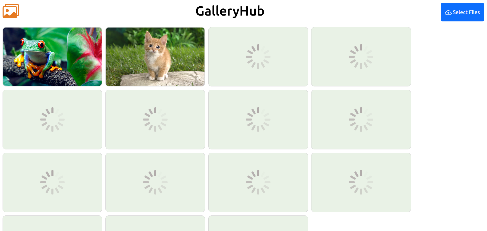

# GalleryHub

The GalleryHub is a web application developed using JavaScript, jQuery, and Spring Web MVC. It provides a seamless platform for users to upload, download, and enjoy a slideshow of images. Whether you are an avid photographer, a passionate artist, or simply looking to share your memories, this application offers a user-friendly interface and a range of features to enhance your image viewing experience.

## Technologies and Tools Used

### Front-End
- HTML5
  - Drag & Drop API
- CSS3
- Parcel.js
- ECMAScript
    - Modules
- Web API
    - DOM API
    - Form data API
- Bootstrap
- Fetch API
- jQuery
    - jQuery AJAX
- CSS Loaders

### Back-End
- Java 11
- Java SE 11
- Spring Framework (Spring Web MVC)

## Features

- Upload and download images.
- Slide show.

## Getting Started

To get started with the GalleryHub web application, follow these steps:

1. Clone the repository: `git clone https://github.com/KasunChathuranga3732/GalleryHub.git`
2. Set up the necessary configurations for the front-end and back-end technologies.
3. Install the required dependencies and libraries.
4. Build and deploy the application.
5. Access the application through the specified URL or port.

## License

Copyright &copy; 2023. All Rights Reserved.

## Contact

For any inquiries or support, please contact [Kasun Chathuranga](mailto:kasunchathuranga3732@gmail.com).

## Screen Shots
### Front View

### Drop Images

### Upload Images

### Slide Show

### Download Image

###

